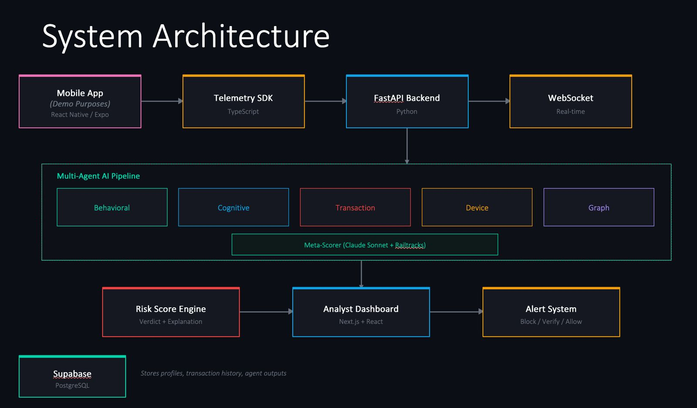

# BlindSpot (GenAI Genesis 2026 Hackaton)

**AI-powered fraud detection that sees what traditional systems miss.**

BlindSpot is a multi-agent fraud detection system built for TD Bank's "Best AI Hack to Detect Financial Fraud" challenge. It goes beyond transaction rules and ML classifiers by analyzing *how* users behave (typing rhythm, touch pressure, cognitive state, navigation patterns) to catch fraud types that conventional systems cannot detect, like Authorized Push Payment (APP) scams where victims willingly transfer money under coercion.

Built with [Railtracks](https://www.railtracks.ai/), Anthropic Claude, FastAPI, and Next.js.

---

## What It Does

A banking user initiates a transaction. BlindSpot captures behavioral telemetry (keystrokes, touch dynamics, session flow) alongside the transaction data and runs it through **6 specialized AI agents** in parallel:

| Agent | What It Analyzes |
|-------|-----------------|
| **Behavioral Biometrics** | Typing speed, rhythm, touch pressure, hand dominance vs. baseline |
| **Cognitive State** | Coercion signals: phone calls during session, dictation patterns, hesitation, dead time |
| **Transaction Pattern** | Amount anomalies (z-scores), velocity, timing, recipient history |
| **Device & Network** | Device fingerprint, VPN/proxy, emulator, remote access detection |
| **Graph Intelligence** | Fan-in/fan-out patterns, mule networks, circular transfers |
| **Meta-Reasoning** | Weighs all 5 agents, detects cross-agent patterns, produces final verdict |

Each agent returns a risk score (0-100), confidence level, specific flags, and natural-language reasoning. The meta-reasoning agent synthesizes everything into an explainable final assessment so a fraud analyst can read *exactly why* a transaction was flagged and what signals contributed.

### What Sets BlindSpot Apart

| Capability | Rule-Based | ML-Based | BlindSpot |
|---|:---:|:---:|:---:|
| Transaction amount/velocity | Yes | Yes | Yes |
| Pattern recognition | Yes | Yes | Yes |
| Device/IP anomaly detection | Limited | Yes | Yes |
| Behavioral biometrics | No | No | **Yes** |
| Cognitive state analysis | No | No | **Yes** |
| Transaction graph intelligence | No | Yes | **Yes** |
| Explainable AI reasoning | No | No | **Yes** |
| Catches APP fraud | No | No | **Yes** |

**Our key differentiator:** We analyze not just *what* happened, but *why and how* the user is behaving. A victim being coached over the phone types differently, hesitates at unusual points, and shows stress patterns that BlindSpot can detect, even though the transaction itself looks voluntary.

---

## System Architecture



Agents 1-5 execute **in parallel** using `asyncio.gather`. The meta-reasoning agent runs after all five complete, synthesizing their outputs with a weighted scoring formula (Cognitive 30%, Behavioral 20%, Transaction 20%, Graph 20%, Device 10%).

---

## Tech Stack

| Layer | Technology |
|-------|-----------|
| **Agent Framework** | [Railtracks](https://www.railtracks.ai/) - Flow, agent_node, function_node |
| **LLM** | Anthropic Claude (claude-sonnet via Railtracks `rt.llm.AnthropicLLM`) |
| **Backend** | Python 3.11+, FastAPI, Pydantic v2 |
| **Dashboard** | Next.js 15, React 19, TypeScript, Tailwind CSS |
| **Mobile Demo** | React Native with Expo |
| **Real-time** | WebSocket for live case updates |
| **Database Layer** | Supabase (PostgreSQL) |

---

## Setup & Running

BlindSpot requires **3 terminals** running simultaneously. Follow the steps below in order.

### Prerequisites

- Python 3.11+
- Node.js 18+
- An [Anthropic API key](https://console.anthropic.com/)

### 1. Clone and configure environment

```bash
git clone <repo-url>
cd blind-spot
```

Create a `.env` file in the project root:

```env
# API Keys
ANTHROPIC_API_KEY=''
MODEL_NAME=claude-sonnet-4-20250514

# Supabase
SUPABASE_URL=''
SUPABASE_KEY=''

# Dashboard Login
DASHBOARD_USER=admin
DASHBOARD_PASS=admin

# Demo User Accounts (username:password)
# mertali-tercan    / mertali-tercan-1
# deniz-coban       / deniz-coban-1
# ediz-uysal        / ediz-uysal-1
```

### 2. Terminal 1 - Backend (FastAPI)

```bash
cd backend
python -m venv venv
source venv/bin/activate        # On Windows: venv\Scripts\activate
pip install -r requirements.txt
python3 -m uvicorn main:app --reload --port 8000 --host 0.0.0.0
```

The backend starts on `http://localhost:8000`. You should see the health check at `http://localhost:8000/api/health`.

### 3. Terminal 2 - Dashboard (Next.js)

```bash
cd dashboard
npm install
npm run dev
```

The analyst dashboard starts on `http://localhost:3000`. Log in with any of the demo user IDs (e.g., `mertali-tercan`, `ediz-uysal`, `deniz-tercan`).

### 4. Terminal 3 - Mobile App (Expo) *(optional, for demo)*

```bash
cd mobile
npm install
npx expo start
```

The mobile app provides a realistic banking interface for demo purposes. It simulates user sessions that generate behavioral telemetry sent to the backend.

### Quick Verification

Once all three are running:

1. Open `http://localhost:3000` - you should see the BlindSpot login page
2. Log in and the monitoring dashboard loads with stat cards, threat signal breakdown, and fraud distribution
3. Use the sidebar to trigger demo scenarios (safe or suspicious transactions)
4. Watch the case appear in real-time via WebSocket, with all 6 agents scoring the transaction

---

## Project Structure

```
blind-spot/
├── backend/
│   ├── main.py                 # FastAPI app entry point
│   ├── config.py               # Environment configuration
│   ├── store.py                # In-memory data store
│   ├── agents/                 # Multi-agent system
│   │   ├── orchestrator.py     # Railtracks Flow pipeline
│   │   ├── behavioral.py       # Typing & touch analysis agent
│   │   ├── cognitive.py        # Coercion & stress detection agent
│   │   ├── transaction.py      # Amount & velocity analysis agent
│   │   ├── device.py           # Device fingerprint agent
│   │   ├── graph.py            # Transaction network agent
│   │   └── meta_scorer.py      # Final reasoning & scoring agent
│   ├── routers/                # API endpoints
│   │   ├── dashboard.py        # Dashboard data + AI chat
│   │   ├── demo.py             # Demo scenario triggers
│   │   └── websocket.py        # Real-time WebSocket
│   └── seed/
│       └── seed_scenarios.py   # Pre-built fraud scenarios
├── dashboard/                  # Next.js analyst dashboard
│   └── src/app/
│       ├── page.tsx            # Login page
│       └── dashboard/
│           ├── page.tsx        # Main monitoring view
│           └── user/[id]/
│               └── page.tsx    # Case detail view
├── mobile/                     # React Native demo app
├── .env                        # API keys (not committed)
├── PLAN.md                     # Full architecture spec
└── CLAUDE.md                   # Development guidelines
```

---

## Demo Scenarios

BlindSpot includes pre-built scenarios that push realistic data through the full pipeline:

| Scenario | What Happens | Expected Risk |
|----------|-------------|---------------|
| **Normal** | Routine transaction matching user baseline | Low (0-30) |
| **APP Fraud** | Victim on phone call, dictated typing, paste on recipient field | High (80+) |
| **Account Takeover** | New device, VPN, password reset, rapid typing | High (75+) |
| **Mule Network** | Fan-in pattern, new account, round amounts | High (70+) |

You can also generate **custom scenarios** via natural language prompts (e.g., "User is being scammed over the phone and sending $5000 to an unknown account"). The system uses AI to generate realistic transaction parameters from the description.

---

## How Railtracks Powers BlindSpot

[Railtracks](https://www.railtracks.ai/) is the agentic framework that orchestrates BlindSpot's multi-agent pipeline. Each specialist agent is defined as an `rt.agent_node()` with its own system prompt and tool nodes, and the orchestrator coordinates them through an `rt.Flow()`:

```python
import railtracks as rt

# Analysis functions become agent tools
@rt.function_node
def compute_typing_features(keystroke_events: str) -> str:
    """Extract typing rhythm features from raw keystroke data."""
    ...

# Each specialist is an agent node
behavioral_agent = rt.agent_node(
    "Behavioral Biometrics Agent",
    tool_nodes=(compute_typing_features, compare_to_baseline),
    llm=rt.llm.AnthropicLLM("claude-sonnet-4-20250514"),
    system_message=BEHAVIORAL_SYSTEM_PROMPT,
)

# Orchestrator flow coordinates all agents
fraud_flow = rt.Flow(name="BlindSpot Pipeline", entry_point=orchestrator)
result = await fraud_flow.invoke(transaction_data)
```

Railtracks gives us async-native parallel execution, structured tool calling, and built-in observability, which is exactly what a real-time fraud detection system needs.

---

## Team

Built at TD AI Hackathon 2025.
